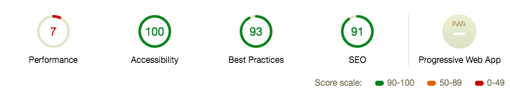

## 4. Component の Lazy load での Code splitting を off にする

<br/>

---

```ts
- const Hoge = React.lazy(() => import(/* webpackChunkName: "Hoge" */ './Hoge'))

+ import Hoge from './Hoge'
```

---



---

### ！


