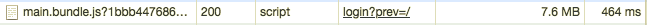
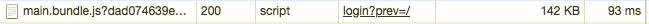
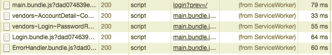
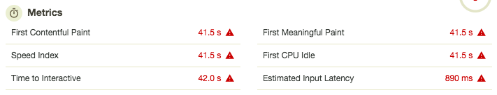
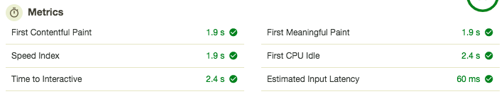
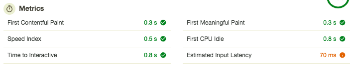

# 0 点達成！！！

---

# 振り返り

---

# ファイルサイズ

---

#### 圧縮なし（0 点）

 

 

#### 圧縮 + Code Splitting

 

 

#### Service Worker

 

 

---

## 142KB → 7782KB（54 倍） へ

---

# スピード

---

#### 圧縮なし（0 点）

 

#### 圧縮 + Code Splitting

 

#### Service Worker

 

---

## First Contentful Paint が 0.3 → 41.5s （138 倍）へ

---

# まとめ： Performance 0 を目指すために

---

### ファイルサイズを増やす = **読み込むデータ量を増やす**と効果に直結

 

- gzip、コード分割、minify をやめるとファイルサイズ増大
- 高画質画像を元画像のまま活用することも効果が期待できる
- 大は小を兼ねる！

---

### 100 点のときと 0 点の時とでは**表示までに体感できるほどの差**がある

 

- 会社設備の高速な回線だと見過ごしがち
- ユーザーはスマホが大半だったりキャリア回線も多い
  - モバイルユーザーはページ表示に 3 秒待てないと言われている
  - 現代人には余裕が必要
  - 3G ならゆっくりお茶を飲むことも可能！

---

# END
